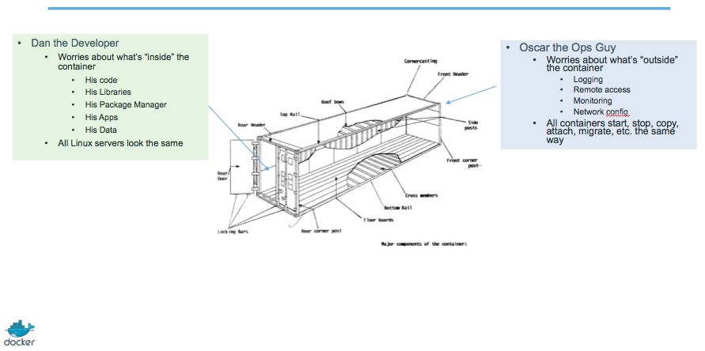

<!SLIDE>
# Elevator pitch

## (for your manager, boss...)

<!SLIDE>
# OK... Why the buzz around containers?

* The software industry has changed.
* Before:
  * monolithic applications
  * long development cycles
  * single environment
  * slowly scaling up
* Now:
  * decoupled services
  * fast, iterative improvements
  * multiple environments
  * quickly scaling out

<!SLIDE>
# Deployment becomes very complex

* Many different stacks:
  * languages
  * frameworks
  * databases
* Many different targets:
  * individual development environments
  * pre-production, QA, staging...
  * production: on prem, cloud, hybrid

<!SLIDE>
# The deployment problem

<!SLIDE>
# The Matrix from Hell

<!SLIDE>
# An inspiration and some ancient history!

<!SLIDE>
# Intermodal shipping containers

<!SLIDE>
# This spawned a Shipping Container Ecosystem!

<!SLIDE>
# A shipping container system for applications

<!SLIDE>
# Eliminate the matrix from Hell

<!SLIDE>
# Results

* Dev-to-prod reduced from 9 months to 15 minutes (ING)

* Continuous integration job time reduced by more than 60% (BBC)

* Dev-to-prod reduced from weeks to minutes (GILT)

<!SLIDE>
# Elevator pitch

## (for your fellow devs and ops)

<!SLIDE>
# Escape dependency hell

1. Write installation instructions into an "INSTALL.txt" file
2. Using this file, write an "install.sh" script that works *for you*
3. Turn this file into a "Dockerfile", test it on your machine
4. If the Dockefile buildson your machine, it will biuld *anywhere*
5. Rejoice as you escape dependency hell and "works on my machine"

Never again "worked in dev - ops problem now!"

<!SLIDE>
# On-board developers and contributors rapidly

1. Write Dockerfiles for your application components
2. Use pre-made images from the Docker Hub (mysql, redis...)
3. Describe your stack with a Compose file
4. On-board somebody with two commands:

          @@@
          git clone ...
          docker-compose up

Also works to create dev, integration, QA environments in minutes!

<!SLIDE>
# Implement reliable CI easily

1. Build test environment with a Dockerfile or Compose file
2. For each test run, stage up a new container or stack
3. Each run is now in a clean environment
4. No pollution from previous tests

Way faster and cheaper than creating VMs each time!

<!SLIDE>
# Use container images as build artefacts

1. Build your app from Dockerfiles
2. Store the resulting images in a registry
3. Keep them forever (or as long as necessary)
4. Test those images in QA, CI, integration...
5. Run the same images in production
6. Something goes wrong? Rollback to previous image
7. Investigating old regression? Old image has your back!

Images contain all the libraries, dependencies, etc. needed to run the app.

<!SLIDE>
# Decouple "plumbing" from application logic

1. Write your code to connect to named services ("db", "api"...)
2. Use Compose to start your stack
3. Docker will setup per-container DNS resolver for those names
4. You can now scale, add load balancers, replication ... without changing your code

Note: this is not covered in this intro level workshop!

<!SLIDE>
# What did Docker bring to the table?

## Docker before/after

<!SLIDE>
# Formats and APIs, before Docker

* No standardized exchange format.
   (No, a rootfs tarball is *not* a format!)
* Containers are hard to use for developers.
   (Where's the equivalent of `docker run debian`?)
* As a result, they are *hidden* from the end users.
* No re-usable components, APIs, tools.
   (At best: VM abstractions, e.g. libvirt.)

Analogy: 

* Shipping containers are not just steel boxes.
* They are steel boxes that are a standard size,
   with the same hooks and holes.

<!SLIDE>
# Formats and APIs, after Docker

* Standardize the container format, because containers were not portable.
* Make containers easy to use for developers.
* Emphasis on re-usable components, APIs, ecosystem of standard tools.
* Improvement over ad-hoc, in-house, specific tools.

<!SLIDE>
# Shipping, before Docker

* Ship packages: deb, rpm, gem, jar, homebrew...
* Dependency hell.
* "Works on my machine."
* Base deployment often done from scratch (debootstrap...) and unreliable.

<!SLIDE>
# Shipping, after Docker

* Ship container images with all their dependencies.
* Images are bigger, but they are broken down into layers.
* Only ship layers that have changed.
* Save disk, network, memory usage.

<!SLIDE>
# Example

Layers:

* CentOS
* JRE
* Tomcat
* Dependencies
* Application JAR
* Configuration

<!SLIDE>
# Devs vs Ops, before Docker

* Drop a tarball (or a commit hash) with instructions.
* Dev environment very different from production.
* Ops don't always have a dev environment themselves ...
* ... and when they do, it can differ from the devs'.
* Ops have to sort out differences and make it work ...
* ... or bounce it back to devs.
* Shipping code causes frictions and delays.

<!SLIDE>
# Devs vs Ops, after Docker

* Drop a container image or a Compose file.
* Ops can always run that container image.
* Ops can always run that Compose file.
* Ops still have to adapt to prod environment,
  but at least they have a reference point.
* Ops have tools allowing to use the same image
  in dev and prod.
* Devs can be empowered to make releases themselves
  more easily.

<!SLIDE>
# Clean separation of concerns

<!SLIDE>
# History of containers ... and Docker

<!SLIDE>
# First experimentations

* [IBM VM/370 (1972)](https://en.wikipedia.org/wiki/VM_(operating_system))
* [Linux VServers (2001)](http://www.solucorp.qc.ca/changes.hc?projet=vserver)
* [Solaris Containers (2004)](https://en.wikipedia.org/wiki/Solaris_Containers)
* [FreeBSD jails (1999)](https://www.freebsd.org/cgi/man.cgi?query=jail&sektion=8&manpath=FreeBSD+4.0-RELEASE)

Containers have been around for a *very long time* indeed.

<!SLIDE>
# VPS-olithic period (until 2007-2008)

<!SLIDE>
# Containers = cheaper than VMs

* Users: hosting providers.
* Highly specialized audience with strong ops culture.

<!SLIDE>
# PaaS-olithic period (2008-2013)

<!SLIDE>
# Containers = easier than VMs

* I can't speak for Heroku, but containers were (one of) dotCloud's secret weapon

<!SLIDE>
# The origins of the Docker Project

* dotCloud was operating a PaaS, using a custom container engine.
* This engine was based on OpenVZ (and later, LXC) and AUFS.
* It started (circa 2008) as a single Python script.
* By 2012, the engine had multiple (~10) Python components.
   (and ~100 other micro-services!)
* End of 2012, dotCloud refactors this container engine.
* The codename for this project is "Docker."

<!SLIDE>
# First public release

* March 2013, PyCon, Santa Clara:
   "Docker" is shown to a public audience for the first time.
* It is released with an open source license.
* Very positive reactions and feedback!
* The dotCloud team progressively shifts to Docker development.
* The same year, dotCloud changes name to Docker.
* In 2014, the PaaS activity is sold.

<!SLIDE>
# Docker early days (2013-2014)

<!SLIDE>
# First users of Docker

* PAAS builders (Flynn, Dokku, Tsuru, Deis...)
* PAAS users (those big enough to justify building their own)
* CI platforms
* developers, developers, developers, developers

<!SLIDE>
# Positive feedback loop

* In 2013, the technology under containers (cgroups, namespaces, copy-on-write storage...)
  had many blind spots.
* The growing popularity of Docker and containers exposed many bugs.
* As a result, those bugs were fixed, resulting in better stability for containers.
* Any decent hosting/cloud provider can run containers today.
* Containers become a great tool to deploy/move workloads to/from on-prem/cloud.

<!SLIDE>
# Maturity (2015-2016)

<!SLIDE>
# Docker becomes an industry standard

* Docker reaches the symbolic 1.0 milestone.
* Existing systems like Mesos and Cloud Foundry add Docker support.
* Standards like OCI, CNCF appear.
* Other container engines are developed.

<!SLIDE>
# Docker becomes a platform

* The initial container engine is now known as "Docker Engine."
* Other tools are added:
  * Docker Compose (formerly "Fig")
  * Docker Machine
  * Docker Swarm
  * Kitematic
  * Docker Cloud (formerly "Tutum")
  * Docker Datacenter
  * etc.
* Docker Inc. launches commercial offers.

<!SLIDE>
# Docker Inc. (the company)

<!SLIDE>
# About Docker Inc.

* Docker Inc. used to be dotCloud Inc.
* dotCloud Inc. used to be a French company.
* Docker Inc. is the primary sponsor and contributor to the Docker Project:
  * Hires maintainers and contributors.
  * Provides infrastructure for the project.
  * Runs the Docker Hub.
* HQ in San Francisco.
* Backed by more than 100M in venture capital.

<!SLIDE>
# How does Docker Inc. make money?

* SAAS
  * Docker Hub (per private repo)
  * Docker Cloud (per node)
* Subscription
  * on-premise stack (Docker Datacenter)
  * DTR (Docker Trusted Registry)
  * UCP (Universal Control Plane)
  * CS (Commercially Supported Engine)
* Support
* Training and professional services

