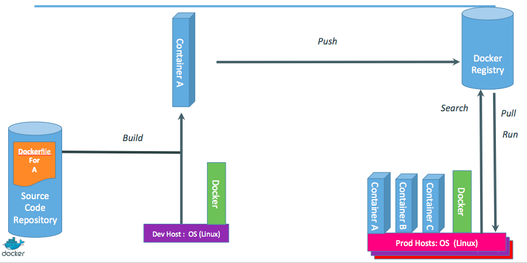

<!SLIDE>
# The origins of the Docker Project

* dotCloud was operating a PaaS, using a custom container engine.
* This engine was based on OpenVZ (and later, LXC) and AUFS.
* It started (circa 2008) as a single Python script.
* By 2012, the engine had multiple (~10) Python components.
   (and ~100 other micro-services!)
* End of 2012, dotCloud refactors this container engine.
* The codename for this project is "Docker."

<!SLIDE>
# First public release

* March 2013, PyCon, Santa Clara:
   "Docker" is shown to a public audience for the first time.
* It is released with an open source license.
* Very positive reactions and feedback!
* The dotCloud team progressively shifts to Docker development.
* The same year, dotCloud changes name to Docker.
* In 2014, the PaaS activity is sold.

<!SLIDE>
# The Docker Project

* The initial container engine is now known as "Docker Engine."
* Other tools have been added:
  * Docker Compose (formerly "Fig")
  * Docker Machine
  * Docker Swarm
  * Kitematic (acquisition)
  * Tutum (recent acquisition)

<!SLIDE>
# About Docker Inc.

* Founded in 2009.
* Formerly dotCloud Inc.
* Primary sponsor of the Docker Project.
  * Hires maintainers and contributors.
  * Provides infrastructure for the project.
  * Runs the Docker Hub.
* HQ in San Francisco.
* Backed by more than 100M in venture capital.

<!SLIDE>
# How does Docker Inc. make money?

* Docker Hub has free and paid services.
* DTR (Docker Trusted Registry).
* Enterprise support for Engine and other products.
* Training and professional services.

<!SLIDE>
# OK... Why the buzz around containers?

* The software industry has changed.
* Before:
  * monolithic applications
  * long development cycles
  * slowly scaling up
* Now:
  * decoupled services
  * fast, iterative improvements
  * quickly scaling out

<!SLIDE>
# Deployment becomes very complex

* Many different stacks.
* Many different targets.

<!SLIDE>
# The deployment problem

<!SLIDE>
# The Matrix from Hell

<!SLIDE>
# An inspiration and some ancient history!

<!SLIDE>
# Intermodal shipping containers

<!SLIDE>
# This spawned a Shipping Container Ecosystem!

<!SLIDE>
# A shipping container system for applications

<!SLIDE>
# Eliminate the matrix from Hell

<!SLIDE>
# From lightweight VMs to application containers

* Containers have been around for a *very long time*.
   (c.f. LXC, Solaris Zones, BSD Jails, LPAR...)
* Why are they trending now?
* What does Docker bring to the table?

<!SLIDE>
# Step 1: containers as lightweight VMs

<!SLIDE>
# Less overhead!

* Users: hosting providers. PaaS industry.
* Highly specialized audience with strong ops culture.

<!SLIDE>
# Step 2: commoditization of containers

<!SLIDE>
# Containers before Docker

* No standardized exchange format.
   (No, a rootfs tarball is *not* a format!)
* Containers are hard to use for developers.
   (Where's the equivalent of `docker run debian`?)
* No re-usable components, APIs, tools.
   (At best: VM abstractions, e.g. libvirt.)

Analogy: 

* Shipping containers are not just steel boxes.
* They are steel boxes that are a standard size,
   with the same hooks and holes.

<!SLIDE>
# Containers after Docker

* Standardize the container format, because containers were not portable.
* Make containers easy to use for developers.
* Emphasis on re-usable components, APIs, ecosystem of standard tools.
* Improvement over ad-hoc, in-house, specific tools.

<!SLIDE>
# Positive feedback loop

* In 2013, the technology under containers (cgroups, namespaces, copy-on-write storage...)
  had many blind spots.
* The growing popularity of Docker and containers exposed many bugs.
* As a result, those bugs were fixed, resulting in better stability for containers.
* Any decent hosting/cloud provider can run containers today.
* Containers become a great tool to deploy/move workloads to/from on-prem/cloud.

<!SLIDE>
# Step 3: shipping containers efficiently

<!SLIDE>
# Before Docker

* Ship packages: deb, rpm, gem, jar...
* Dependency hell.
* "Works on my machine."
* Base deployment often done from scratch (debootstrap...) and unreliable.

<!SLIDE>
# After Docker

* Ship container images with all their dependencies.
* Break image into layers.
* Only ship layers that have changed.
* Save disk, network, memory usage.

<!SLIDE>
# Example

Layers:

* CentOS
* JRE
* Tomcat
* Dependencies
* Application JAR
* Configuration

<!SLIDE>
# Step 4: containers in a modern software factory

<!SLIDE>
# Container image as build artifact

The same container can go from dev, to test, to QA, to prod.

<!SLIDE>
# Technical & cultural revolution: separation of concerns

