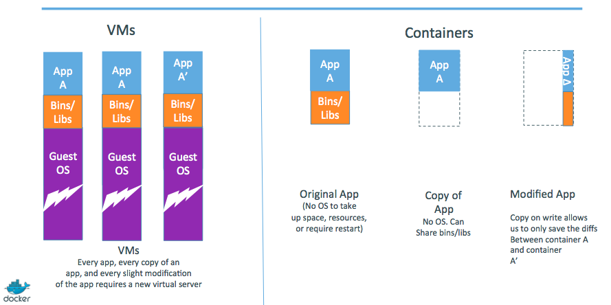

<!SLIDE>
# About Docker Inc.

Focused on Docker and growing the Docker ecosystem:

* Founded in 2009.
* Formerly dotCloud Inc.
* Released Docker in 2013.

<!SLIDE>
# What does Docker Inc. do?

* Docker Engine - open source container management.
* Docker Hub - online home and hub for managing your Docker containers.
* Docker Enterprise Support - commercial support for Docker.
* Docker Services & Training - professional services and training to help
  you get the best out of Docker.

<!SLIDE>
# Why Docker?

* The software industry has changed.
* Applications used to be monolithic, with long lifecycles, scaled up.
* Today, applications are decoupled, built iteratively, scaled out.
* As a result, deployment is though!

<!SLIDE>
# The problem in 2015

<!SLIDE>
# The Matrix from Hell

<!SLIDE>
# An inspiration and some ancient history!

<!SLIDE>
# Intermodal shipping containers

<!SLIDE>
# This spawned a Shipping Container Ecosystem!

<!SLIDE>
# A shipping container system for applications

<!SLIDE>
# Eliminate the matrix from Hell

<!SLIDE>
# Docker high-level roadmap

* Step 1: containers as lightweight VMs
* Step 2: commoditization of containers
* Step 3: shipping containers efficiently
* Step 4: containers in a modern software factory

<!SLIDE>
# Step 1: containers as lightweight VMs

* This drew attention from hosting and PAAS industry.
* Highly technical audience with strong ops culture.

<!SLIDE>
# Step 2: commoditization of containers

Container technology has been around for a while.
 (c.f. LXC, Solaris Zones, BSD Jails, LPAR...)

So what's new?

* Standardize the container format, because containers were not portable.
* Analogy: 
  - shipping containers are not just steel boxes
  - they are steel boxes that are a standard size, with the same hooks and holes
* Make containers easy to use for developers.
* Emphasis on re-usable components, APIs, ecosystem of standard tools.
* Improvement over ad-hoc, in-house, specific tools.

<!SLIDE>
# Running containers everywhere

* Maturity of underlying technology (cgroups, namespaces, copy-on-write systems).
* Ability to run on any Linux server today: physical, virtual, VM, cloud, OpenStack...
* Ability to move between any of the above in a matter of seconds-no modification or delay.
* Ability to share containerized components.
* Self contained environment - no dependency hell.
* Tools for how containers work together: linking, discovery, orchestration...

<!SLIDE>
# Technical & cultural revolution: separation of concerns

<!SLIDE>
# Step 3: shipping containers efficiently

Ship container images, made of reusable shared layers.

Optimizes disk usage, memory usage, network usage.

<!SLIDE>
# Step 4: containers in a modern software factory

The container becomes the new build artefact.

The same container can go from dev, to test, to QA, to prod.

<!SLIDE>
# Docker architecture

Docker is a client-server application.

* **The Docker daemon**
   Receives and processes incoming Docker API requests.

* **The Docker client**
   Command line tool - the ``docker`` binary.
   Talks to the Docker daemon via the Docker API.

* **Docker Hub Registry**
   Public image registry.
   The Docker daemon talks to it via the registry API.

