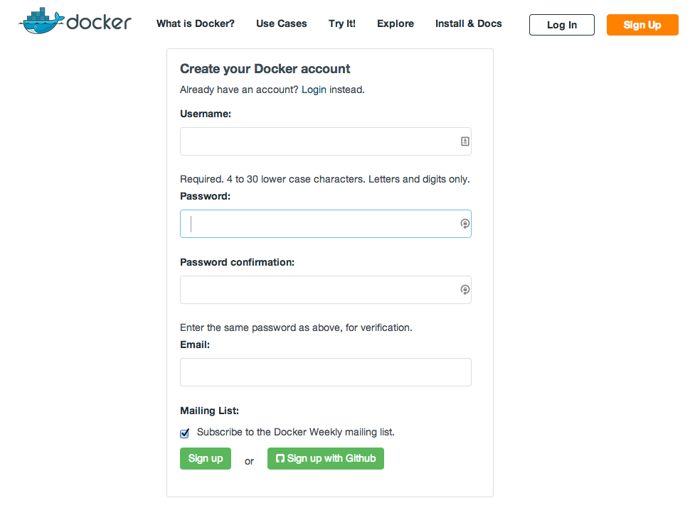

<!SLIDE>
# How does Docker work?

* Docker provides workflow and management for your applications.
* Docker builds, runs and manages images and containers.
* Docker is a client-server application.

<!SLIDE>
# Image

* An image is the source for your containers.
* You can launch containers from your images.
* Images are "built" and can be stored and distributed via a registry
  like the Docker Hub.
* Images are layered and versioned.

<!SLIDE>
# Images are layered

<!SLIDE>
# Layers

* Each image is made up of layers.
* The bottom layer is a regular Linux root file system.
* When a Linux host boots, it mounts its root file system read-write ...
* ... Docker however uses copy-on-write, so that this bottom layer
  stays read-only, and all changes go to a new layer sitting above.
* The container can become an image on its own by freezing the top layer.
* When that image is started, a new writable layer is added on top of
  the stack.

<!SLIDE>
# Registry

* Stores images.

* The registry is like git for containers.

    It holds all of the revisions of each container.

* Docker pushes and pulls images from the registry.

* The Docker Hub features a public registry.

    You can also run your own.

<!SLIDE>
# Container

* Containers are launched from images.
* They contain one or more running processes.
* Can be started, stopped, restarted and killed.

<!SLIDE>
# Images versus containers?

* An image is a stopped container.
* You make an image by committing a container.
* Images are building, containers are running.

<!SLIDE>
# Registry versus Docker Hub?

* A registry is a place to store Docker images.

* The Docker Hub is a set of services operated by Docker Inc.

    Those services include a registry.

* If need be, you can run your own registry.

*Note: the Docker Hub used to be known as `docker.io`.*

<!SLIDE>
# Create a Docker Hub account

* Sign up on [hub.docker.com](https://hub.docker.com/).

<!SLIDE>
# Section summary

We've learned:

* About Docker Inc.
* About Docker.
* How to create an account on the Docker Hub.

<!SLIDE supplemental exercises>
# Lab ~~~SECTION:MAJOR~~~.~~~SECTION:MINOR~~~: Create a Docker Hub account

1. Open a browser window.

2. Browse to the Docker Hub site.

         @@@ Sh
         https://hub.docker.com/

3. Click on the ``Sign-up`` link.

         @@@ Sh
         https://hub.docker.com/account/signup/

<!SLIDE supplemental exercises>
# Lab ~~~SECTION:MAJOR~~~.~~~SECTION:MINOR~~~: Create a Docker Hub account

1. Create a Docker Hub account.

2. Verify your Docker Hub account.

3. Login to your Docker Hub account.

        @@@ Sh
        https://hub.docker.com/account/login/

<!SLIDE supplemental exercises>
# Lab ~~~SECTION:MAJOR~~~.~~~SECTION:MINOR~~~: Optional: Create a GitHub account

1. If you don't already have a GitHub account it'll be pretty useful later on.

        @@@ Sh
        https://github.com/join
