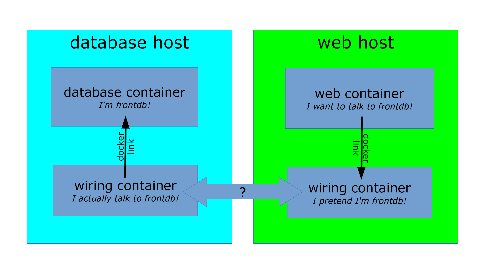

<!SLIDE>
# Ambassadors

We've already seen a couple of ways we can manage our application
architecture in Docker.

* With links.
* Using host-based volumes.
* Using data volumes shared between containers.

We're now going to see a pattern for service portability we call:
ambassadors.

<!SLIDE>
# Introduction to Ambassadors

The ambassador pattern:

* Takes advantage of Docker's lightweight linkages and abstracts
  connections between services.
* Allows you to manage services without hard-coding connection
  information inside applications.

To do this, instead of directly connecting containers you insert
ambassador containers.

<!SLIDE>

<!SLIDE>
# Interacting with ambassadors

* The web application container uses a normal link to connect
  to the ambassador.
* The database container is linked with an ambassador as well.
* For both containers, there is no difference between normal
  operation and operation with ambassador containers.
* If the database container is moved, its new location will
  be tracked by the ambassador containers, and the web application
  container will still be able to connect, without reconfiguration.

<!SLIDE>
# Implementing the ambassador pattern

Different deployments will use different underlying technologies.

* On-premise deployments with a trusted network can track
  container locations in e.g. Zookeeper, and generate HAproxy
  configurations each time a location key changes.
* Public cloud deployments or deployments across unsafe
  networks can add TLS encryption.
* Ad-hoc deployments can use a master-less discovery protocol
  like avahi to register and discover services.
* It is also possible to do one-shot reconfiguration of the
  ambassadors. It is slightly less dynamic but has much less
  requirements.

<!SLIDE>
# Section summary

We've learned how to:

* Understand the ambassador pattern and what it is used for (service portability).

For more information about the ambassador pattern, including demos on Swarm and ECS: look for [DVO317](https://www.youtube.com/watch?v=7CZFpHUPqXw) (AWS re:invent talk).
