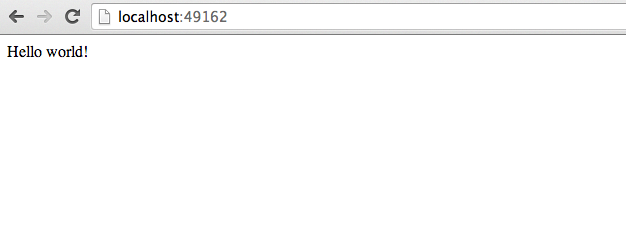

<!SLIDE>
# Introduction to building images

## ``Dockerfile`` and ``docker build``

Let's see how to build our own images using:

* A ``Dockerfile`` which holds Docker image definitions.

    You can think of it as the "build recipe" for a Docker image.

    It contains a series of instructions telling Docker how an image is constructed.

* The ``docker build`` command which builds an image from a ``Dockerfile``.

<!SLIDE>
# Building your own ``Dockerfile``

1. Create a directory to hold our ``Dockerfile``.

        @@@ Sh
        $ mkdir web_image

2. Create a ``Dockerfile`` inside this directory.

        @@@ Sh
        $ cd web_image
        $ touch Dockerfile

3. Edit our ``Dockerfile``.

        @@@ Sh
        $ vim Dockerfile

<!SLIDE>
# Our first ``Dockerfile``

    @@@ docker
    # You can download that file from:
    # https://github.com/docker-training/staticweb
    FROM ubuntu:14.04
    MAINTAINER Docker Education Team <education@docker.com>

    RUN apt-get update
    RUN apt-get install -y nginx
    RUN echo 'Hi, I am in your container' \
        >/usr/share/nginx/html/index.html

    CMD [ "nginx", "-g", "daemon off;" ]

    EXPOSE 80

* ``FROM`` specifies a source image for our new image. It's mandatory.
* ``MAINTAINER`` tells us who maintains this image.
* Each ``RUN`` instruction executes a command to build our image.
* ``CMD`` defines the default command to run when a container
  is launched from this image.
* ``EXPOSE`` lists the network ports to open when
  a container is launched from this image.

<!SLIDE>
# ``Dockerfile`` usage summary

* ``Dockerfile`` instructions are executed in order.
* Each instruction creates a new layer in the image.
* Instructions are cached. If no changes are detected then the
  instruction is skipped and the cached layer used.
* The ``FROM`` instruction MUST be the first non-comment instruction.
* Lines starting with ``#`` are treated as comments.
* You can only have one ``CMD`` and one ``ENTRYPOINT`` instruction in a ``Dockerfile``.

<!SLIDE>
# Building our ``Dockerfile``

We use the ``docker build`` command to build images.

    @@@ Sh
    $ docker build -t <dockerhubUsername>/web .

* The ``-t`` flag tags an image.
* The ``.`` indicates the location of the ``Dockerfile`` being built.

You can now see the image in ``docker images`` output:

    @@@ Sh
    $ docker images <dockerhubUsername>/web

We can also build from other sources, such as a remote git repository.

    @@@ Sh
    $ docker build -t <dockerhubUsername>/web https://github.com/docker-training/staticweb.git

<!SLIDE>
# What happens when we build the image?

When we run the ``docker build`` command we'll see a series of steps
executed.

    @@@ Sh
    $ docker build -t <dockerhubUsername>/web .
    Sending build context to Docker daemon  2.56 kB
    Sending build context to Docker daemon
    Step 0 : FROM ubuntu:14.04
     ---> 99ec81b80c55
    Step 1 : MAINTAINER Docker Education Team <education@docker.com>
     ---> Running in 79698fa44f2e
     ---> a9953e67750b
     Removing intermediate container 79698fa44f2e
    Step 2 : RUN apt-get update
     ---> Running in 1e11e4949681

* The ``Dockerfile`` instructions are executed in order as steps.
* Each instruction creates a container, runs the instruction in that
  container, creates a new layer in the image and removes the container.

<!SLIDE>
# The build context

    @@@ Sh
    $ docker build -t <dockerhubUsername>/web .
    Sending build context to Docker daemon  2.56 kB
    Sending build context to Docker daemon

* When building images Docker uploads the local "context" to the Docker
  host. The context is the content of your local directory.

<!SLIDE>
# The ``FROM`` instruction

* Specifies the source image to build this image.
* Must be the first instruction in the ``Dockerfile``, except for comments.

<!SLIDE>
# The ``FROM`` instruction
Can specify a base image:

    @@@ docker
    FROM ubuntu

An image tagged with a specific version:

    @@@ docker
    FROM ubuntu:12.04

A user image:

    @@@ docker
    FROM training/sinatra

Or self-hosted image:

    @@@ docker
    FROM localhost:5000/funtoo

<!SLIDE>
# More about ``FROM``

* The ``FROM`` instruction can be specified more than once to build
  multiple images.

        @@@ docker
        FROM ubuntu:14.04
        . . .
        FROM fedora:20
        . . .

    Each ``FROM`` instruction marks the beginning of the build of a new image.

    The ``-t`` command-line parameter will only apply to the last image.

* If the build fails, existing tags are left unchanged.

* An optional version tag can be added after the name of the image.

    E.g.: ``ubuntu:14.04``.

<!SLIDE>
# The ``MAINTAINER`` instruction

The ``MAINTAINER`` instruction tells you who wrote the ``Dockerfile``.

    @@@ docker
    MAINTAINER Docker Education Team <education@docker.com>

It's optional but recommended.

<!SLIDE>
# The ``RUN`` instruction

The ``RUN`` instruction can be specified in two ways.

With shell wrapping, which runs the specified command inside a shell,
with ``/bin/sh -c``:

    @@@ docker
    RUN apt-get update

Or using the ``exec`` method, which avoids shell string expansion, and
allows execution in images that don't have ``/bin/sh``:

    @@@ docker
    RUN [ "apt-get", "update" ]

<!SLIDE>
# More about the ``RUN`` instruction

``RUN`` will do the following:

* Execute a command.
* Record changes made to the filesystem.
* Work great to install libraries, packages, and various files.

``RUN`` will NOT do the following:

* Record state of *processes*.
* Automatically start daemons.

If you want to start something automatically when the container runs,
you should use ``CMD`` and/or ``ENTRYPOINT``.

<!SLIDE>
# The ``EXPOSE`` instruction

The ``EXPOSE`` instruction tells Docker what ports are to be published
in this image.

    @@@ docker
    EXPOSE 8080

* All ports are private by default.
* The ``Dockerfile`` doesn't control if a port is publicly available.
* When you ``docker run -p <port> ...``, that port becomes public.

    (Even if it was not declared with ``EXPOSE``.)

* When you ``docker run -P ...`` (without port number), all ports
  declared with ``EXPOSE`` become public.

A *public port* is reachable from other containers and from outside the host.

A *private port* is not reachable from outside.

<!SLIDE>
# The ``ADD`` instruction

The ``ADD`` instruction adds files and content from your host into the
image.

    @@@ docker
    ADD /src/webapp /opt/webapp

This will add the contents of the ``/src/webapp/`` directory to the
``/opt/webapp`` directory in the image.

Note: ``/src/webapp/`` is not relative to the host filesystem, but to
the directory containing the ``Dockerfile``.

Otherwise, a ``Dockerfile`` could succeed on host A, but fail on host B.

The ``ADD`` instruction can also be used to get remote files.

    @@@ docker
    ADD http://www.example.com/webapp /opt/

This would download the ``webapp`` file and place it in the ``/opt``
directory.

<!SLIDE>
# More about the ``ADD`` instruction

* ``ADD`` is cached. If you recreate the image and no files have changed then a cache is used.
* If the local source is a zip file or a tarball it'll be unpacked to the destination.
* Sources that are URLs and zipped will not be unpacked.
* Any files created by the ``ADD`` instruction are owned by ``root``
  with permissions of ``0755``.

More on ``ADD`` [here](http://docs.docker.io/reference/builder/#add).

<!SLIDE>
# The ``VOLUME`` instruction

The ``VOLUME`` instruction will create a data volume mount point at the
specified path.

    @@@ docker
    VOLUME [ "/opt/webapp/data" ] 

* Data volumes bypass the union file system.

    In other words, they are not captured by ``docker commit``.

* Data volumes can be shared and reused between containers.

    We'll see how this works in a subsequent lesson.

* It is possible to share a volume with a stopped container.
* Data volumes persist until all containers referencing them are destroyed.

<!SLIDE>
# The ``WORKDIR`` instruction

The ``WORKDIR`` instruction sets the working directory for subsequent
instructions.

It also affects ``CMD`` and ``ENTRYPOINT``, since it sets the working
directory used when starting the container.
   
    @@@ docker
    WORKDIR /opt/webapp

You can specify ``WORKDIR`` again to change the working directory for
further operations.

<!SLIDE>
# The ``ENV`` instruction

The ``ENV`` instruction specifies environment variables that should be
set in any container launched from the image.

    @@@ docker
    ENV WEBAPP_PORT 8080

This will result in an environment variable being created in any
containers created from this image of

    @@@ Sh
    WEBAPP_PORT=8080

You can also specify environment variables when you use ``docker run``.

    @@@ Sh
    $ docker run -e WEBAPP_PORT=8000 -e WEBAPP_HOST=www.example.com ...

<!SLIDE>
# The ``USER`` instruction

The ``USER`` instruction sets the user name or UID to use when running
the image.

It can be used multiple times to change back to root or to another user.

<!SLIDE>
# The ``CMD`` instruction

The ``CMD`` instruction is a default command run when a container is
launched from the image.

    @@@ docker
    CMD [ "nginx", "-g", "daemon off;" ]

Means we don't need to specify ``nginx -g "daemon off;"`` when running the
container.

Instead of:

    @@@ Sh
    $ docker run <dockerhubUsername>/web nginx -g "daemon off;"

We can just do:

    @@@ Sh
    $ docker run <dockerhubUsername>/web

<!SLIDE>
# More about the ``CMD`` instruction

Just like ``RUN``, the ``CMD`` instruction comes in two forms.
The first executes in a shell:

    @@@ docker
    CMD nginx -g "daemon off;"

The second executes directly, without shell processing:

    @@@ docker
    CMD [ "nginx", "-g", "daemon off;" ]

<!SLIDE>
# Overriding the ``CMD`` instruction

The ``CMD`` can be overridden when you run a container.

    @@@ Sh
    $ docker run -t -i <dockerhubUsername>/web /bin/bash

Will run ``/bin/bash`` instead of ``nginx -g "daemon off;"``.

<!SLIDE>
# The ``ENTRYPOINT`` instruction

The ``ENTRYPOINT`` instruction is like the ``CMD`` instruction,
but arguments given on the command line are *appended* to the
entry point.

Note: you have to use the "exec" syntax (``[ "..." ]``).

    @@@ docker
    ENTRYPOINT [ "/bin/ls" ]

If we were to run:

    @@@ Sh
    $ docker run training/ls -l

Instead of trying to run ``-l``, the container will run ``/bin/ls -l``.

<!SLIDE>
# Overriding the ``ENTRYPOINT`` instruction

The entry point can be overriden as well.

    @@@ Sh
    $ docker run -t -i training/ls
    bin   dev  home  lib64  mnt  proc  run   srv  tmp  var
    boot  etc  lib   media  opt  root  sbin  sys  usr
    $ docker run --entrypoint /bin/bash -t -i training/ls
    root@d902fb7b1fc7:/#

<!SLIDE>
# How ``CMD`` and ``ENTRYPOINT`` interact

The ``CMD`` and ``ENTRYPOINT`` instructions work best when used
together.

    @@@ docker
    ENTRYPOINT [ "nginx" ]
    CMD [ "-g", "daemon off;" ]

The ``ENTRYPOINT`` specifies the command to be run and the ``CMD``
specifies its options. On the command line we can then potentially
override the options when needed.

    @@@ Sh
    $ docker run -d <dockerhubUsername>/web -t

This will override the options ``CMD`` provided with new flags.

<!SLIDE>
# The ``ONBUILD`` instruction

The ``ONBUILD`` instruction is a trigger. It sets instructions that will
be executed when another image is built from the image being build.

This is useful for building images which will be used as a base
to build other images.

    @@@ docker
    ONBUILD ADD . /app/src

* You can't chain ``ONBUILD`` instructions with ``ONBUILD``.
* ``ONBUILD`` can't be used to trigger ``FROM`` and ``MAINTAINER``
  instructions.

<!SLIDE>
# Running a container from our image

1. Now let's run a container from our new image using the ``docker run``
   command.  The ``-P`` automatically maps all ports exposed in an image to 
   random ports on the host.

        @@@ Sh
        $ docker run -d -P <dockerhubUsername>/webapp

2. Now checkout our running container using the ``docker ps`` command. The 
   ``-l`` flag returns the last container created.

        @@@ Sh
        $ docker ps -l

<!SLIDE>
# Running a container from our image

In the output of ``docker ps`` you should see something like:

        @@@ Sh
        CONTAINER ID IMAGE         COMMAND       CREATED       STATUS       PORTS                   NAMES
        25af0d10060f webapp:latest python app.py 2 minutes ago Up 2 minutes 0.0.0.0:49162->5000/tcp tender_newton

Make a note of the port number port ``5000`` is being redirected to.

<!SLIDE>
# Using our web application

1. Open a browser and browse to the redirected port on the Docker host.

         @@@ Sh
         http://<yourHostIP>:redirectedport

2. You should see something like.

<!SLIDE>
# Building an efficient ``Dockerfile`` 

* Each line in a ``Dockerfile`` creates a new layer.
* Build your ``Dockerfile`` to take advantage of Docker's caching system.
* Combine multiple similar commands into one by using ``&&`` to continue commands and ``\`` to wrap lines.
* ``ADD`` dependency lists (``package.json``,``requirements.txt``, etc.) by themselves to avoid reinstalling unchanged dependencies every time.

<!SLIDE>
# Example "bad" ``Dockerfile``

The dependencies are reinstalled every time, because the build system does not know if ``requirements.txt`` has been updated.

        @@@ Sh
        FROM ubuntu:14.04
        MAINTAINER Docker Education Team <education@docker.com>
        RUN apt-get update
        RUN DEBIAN_FRONTEND=noninteractive apt-get install -y -q \
            python-all python-pip 
        ADD ./webapp /opt/webapp/
        WORKDIR /opt/webapp
        RUN pip install -qr requirements.txt
        EXPOSE 5000
        CMD ["python", "app.py"]

<!SLIDE>
# Fixed ``Dockerfile``

Adding the dependencies as a separate step means that Docker can cache more efficiently and only install them when ``requirements.txt`` changes.

        @@@ sh
        FROM ubuntu:14.04
        MAINTAINER Docker Education Team <education@docker.com>
        RUN apt-get update
        RUN DEBIAN_FRONTEND=noninteractive apt-get install -y -q \
            python-all python-pip 
        ADD ./webapp/requirements.txt /tmp/requirements.txt
        RUN pip install -qr /tmp/requirements.txt
        ADD ./webapp /opt/webapp/
        WORKDIR /opt/webapp
        EXPOSE 5000
        CMD ["python", "app.py"]

<!SLIDE>
# Summary

We've learned how to:

* Understand the instructions for a ``Dockerfile``.
* Create your own ``Dockerfile``.
* Build an image from a ``Dockerfile``.
* Override the ``CMD`` when you ``docker run``.

<!SLIDE supplemental exercises>
# Lab ~~~SECTION:MAJOR~~~.~~~SECTION:MINOR~~~: Building your own ``Dockerfile``

1. Create a directory to hold our ``Dockerfile``.

        @@@ Sh
        $ mkdir web_image

2. Create a ``Dockerfile`` inside this directory.

        @@@ Sh
        $ cd web_image
        $ touch Dockerfile

3. Edit our ``Dockerfile``.

        @@@ Sh
        $ vim Dockerfile

<!SLIDE supplemental exercises>
# Lab ~~~SECTION:MAJOR~~~.~~~SECTION:MINOR~~~: Adding ``FROM`` and ``MAINTAINER`` instructions

1. Let's start with a ``FROM`` instruction.

        @@@ docker
        FROM ubuntu:14.04

2. Add a ``MAINTAINER`` instruction.

         @@@ docker
         MAINTAINER Your Name <your@email.com>

<!SLIDE supplemental exercises>
# Lab ~~~SECTION:MAJOR~~~.~~~SECTION:MINOR~~~: Installing some packages to support our application

1. Update, install some required packages, and add a simple site to be served, using the ``RUN`` instruction.

         @@@ docker
         RUN apt-get update
         RUN apt-get install -y nginx
         RUN echo 'Hi, I am in your container' \
             >/usr/share/nginx/html/index.html

<!SLIDE supplemental exercises>
# Lab ~~~SECTION:MAJOR~~~.~~~SECTION:MINOR~~~: Install our web application.

1. Set the `CMD` instruction using the array notation.  This will be run when
the container is started.

        @@@ docker
        CMD ["nginx", "-g", "daemon off;"]

2. Lastly, use `EXPOSE` to expose port 80.

        @@@ docker
        EXPOSE 80

<!SLIDE supplemental exercises>
# Lab ~~~SECTION:MAJOR~~~.~~~SECTION:MINOR~~~: Building our web application image.

1. Use ``docker build`` to build our image.

        @@@ Sh
        $ docker build -t <dockerhubUsername>/webapp .

2. Review the build image with ``docker image``.

        @@@ Sh
        $ docker image <dockerhubUsername>/webapp
        REPOSITORY                 TAG     IMAGE ID      CREATED        VIRTUAL SIZE
        <dockerhubUsername>/webapp latest  e2a9fac29d86  12 seconds ago 246.8 MB

<!SLIDE supplemental exercises>
# Lab ~~~SECTION:MAJOR~~~.~~~SECTION:MINOR~~~: Overriding the ``CMD`` instruction

1. Specify a command to run instead of the ``CMD`` defined when doing ``docker
   run``:

        @@@Sh
        docker run -t -t <dockerhubUsername>/web /bin/bash

   This overrides the default ``CMD``.

<!SLIDE supplemental exercises>
# Lab ~~~SECTION:MAJOR~~~.~~~SECTION:MINOR~~~: Overriding the ``ENTRYPOINT`` instruction

1.  Specify a command to run instead of the ``ENTRYPOINT`` defined in the
    Dockerfile.

    Without ``--entrypoint``:

        @@@ Sh
        $ docker run -t -i training/ls
        bin   dev  home  lib64  mnt  proc  run   srv  tmp  var
        boot  etc  lib   media  opt  root  sbin  sys  usr

    With ``--entrypoint``:

        @@@ Sh
        $ docker run --entrypoint /bin/bash -t -i training/ls
        root@d902fb7b1fc7:/#

<!SLIDE supplemental exercises>
# Lab ~~~SECTION:MAJOR~~~.~~~SECTION:MINOR~~~: Running a container from our image

1. Now let's run a container from our new image using the ``docker run``
   command.  The ``-P`` automatically maps all ports exposed in an image to 
   random ports on the host.

        @@@ Sh
        $ docker run -d -P <dockerhubUsername>/webapp

2. Now checkout our running container using the ``docker ps`` command. The 
   ``-l`` flag returns the last container created.

        @@@ Sh
        $ docker ps -l

3. You should see something like:

         @@@ Sh
         CONTAINER ID IMAGE                      COMMAND       CREATED       STATUS       PORTS                   NAMES
         25af0d10060f <dockerhubUsername>/webapp:latest python app.py 2 minutes ago Up 2 minutes 0.0.0.0:49162->5000/tcp tender_newton

   Make a note of the port number port ``5000`` is being redirected to.

<!SLIDE supplemental exercises>
# Lab ~~~SECTION:MAJOR~~~.~~~SECTION:MINOR~~~: Using our web application

1. Open a browser and browse to the redirected port on the Docker host.

         @@@ Sh
         http://<yourHostIP>:redirectedport

2. You should see something like.

