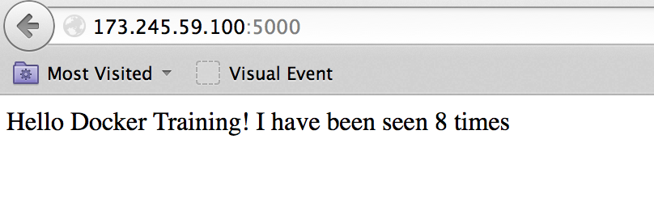

<!SLIDE>
# What is Docker Compose?

Docker Compose (formerly known as fig) is an external tool. It is optional (you do not
need Compose to run Docker and containers) but we recommend it highly!

The general idea of Compose is to enable a very simple, powerful onboarding workflow:

1. Clone your code.
2. Run `docker-compose up`.
3. Your app is up and running!

<!SLIDE>
# Compose overview

This is how you work with Compose:

* You describe a set (or stack) of containers in a YAML file called `docker-compose.yml`.
* You run `docker-compose up`.
* Compose automatically pulls images, builds containers, and starts them.
* Compose can set up links, volumes, and other Docker options for you.
* Compose can run the containers in the background, or in the foreground.
* When containers are running in the foreground, their aggregated output is shown.

Before diving in, let's see a small example of Compose in action.

<!SLIDE>
# Compose in action

<!SLIDE>
# Checking if Compose is installed

If you are using the official training virtual machines, Compose has been
pre-installed.

You can always check that it is installed by running:

    @@@ Sh
    $ docker-compose --version

<!SLIDE>
# Installing Compose

If you want to install Compose on your machine, there are (at least) two methods.

Compose is written in Python. If you have `pip` and use it to manage other Python
packages, you can install compose with:

    @@@ Sh
    $ sudo pip install docker-compose

(Note: if you are familiar with `virtualenv`, you can also use it to install Compose.)

If you do not have `pip`, or do not want to use it to install Compose, you can
also retrieve an all-in-one binary file:

    @@@ Sh
    $ curl -L \
      https://github.com/docker/compose/releases/download/1.8.0/docker-compose-`uname -s`-`uname -m` \
      > /usr/local/bin/docker-compose
    $ chmod +x /usr/local/bin/docker-compose

<!SLIDE>
# Launching Our First Stack with Compose

First step: clone the source code for the app we will be working on.

    @@@ Sh
    $ cd
    $ git clone git://github.com/jpetazzo/trainingwheels
    ...
    $ cd trainingwheels

Second step: start your app.

    @@@ Sh
    $ docker-compose up

Watch Compose build and run your app with the correct parameters,
including linking the relevant containers together.

<!SLIDE>
# Launching Our First Stack with Compose

Verify that the app is running at `http://<yourHostIP>:8000`.

<!SLIDE>
# Stopping the app

When you hit `^C`, Compose tries to gracefully terminate all of the containers.

After ten seconds (or if you press `^C` again) it will forcibly kill
them.

<!SLIDE>
# The `docker-compose.yml` file

Here is the file used in the demo:

    @@@ YAML
    version: "2"

    services:
      www:
        build: www
        ports:
          - 8000:5000
        user: nobody
        environment:
          DEBUG: 1
        command: python counter.py
        volumes:
          - ./www:/src

      redis:
        image: redis

<!SLIDE>
# Compose file versions

Version 1 directly has the various containers (`www`, `redis`...) at the top level of the  file.

Version 2 has multiple sections:

* `version` is mandatory and should be `"2"`.
* `services` is mandatory and corresponds to the content of the version 1 format.
* `networks` is optional and can define multiple networks on which containers can be placed.
* `volumes` is optional and can define volumes to be used (and potentially shared) by the containers.

<!SLIDE>
# Containers in `docker-compose.yml`

Each service in the YAML file must contain either `build`, or `image`.

* `build` indicates a path containing a Dockerfile.
* `image` indicates an image name (local, or on a registry).

The other parameters are optional.

They encode the parameters that you would typically add to `docker run`.

Sometimes they have several minor improvements.

<!SLIDE>
# Container parameters

* `command` indicates what to run (like `CMD` in a Dockerfile).
* `ports` translates to one (or multiple) `-p` options to map ports.
   You can specify local ports (i.e. `x:y` to expose public port `x`).
* `volumes` translates to one (or multiple) `-v` options.
   You can use relative paths here.

For the full list, check http://docs.docker.com/compose/yml/.

<!SLIDE>
# Compose commands

We already saw `docker-compose up`, but another one is `docker-compose build`.
It will execute `docker build` for all containers mentioning a `build` path.

It is common to execute the build and run steps in sequence:

    @@@ Sh
    docker-compose build && docker-compose up

Another common option is to start containers in the background:

    @@@ Sh
    docker-compose up -d

<!SLIDE>
# Check container status

It can be tedious to check the status of your containers with `docker ps`,
especially when running multiple apps at the same time.

Compose makes it easier; with `docker-compose ps` you will see only the status of the
containers of the current stack:

    @@@ Sh
    $ docker-compose ps
    Name                      Command             State           Ports          
    ----------------------------------------------------------------------------
    trainingwheels_redis_1   /entrypoint.sh red   Up      6379/tcp               
    trainingwheels_www_1     python counter.py    Up      0.0.0.0:8000->5000/tcp 

<!SLIDE>
# Cleaning up

If you have started your application in the background with Compose and
want to stop it easily, you can use the `kill` command:

    @@@ Sh
    $ docker-compose kill

Likewise, `docker-compose rm` will let you remove containers (after confirmation):

    @@@ Sh
    $ docker-compose rm
    Going to remove trainingwheels_redis_1, trainingwheels_www_1
    Are you sure? [yN] y
    Removing trainingwheels_redis_1...
    Removing trainingwheels_www_1...

Alternatively, `docker-compose down` will stop and remove containers.

    @@@ Sh
    $ docker-compose down
    Stopping trainingwheels_www_1 ... done
    Stopping trainingwheels_redis_1 ... done
    Removing trainingwheels_www_1 ... done
    Removing trainingwheels_redis_1 ... done

<!SLIDE>
# Special handling of volumes

Compose is smart. If your container uses volumes, when you restart your
application, Compose will create a new container, but carefully re-use
the volumes it was using previously.

This makes it easy to upgrade a stateful service, by pulling its
new image and just restarting your stack with Compose.

<!SLIDE supplemental exercises>
# Lab ~~~SECTION:MAJOR~~~.~~~SECTION:MINOR~~~: Installing compose

To install `docker-compose`:

    @@@ Sh
    curl -L \
      https://github.com/docker/compose/releases/download/1.2.0/docker-compose-`uname -s`-`uname -m` \ 
      > /usr/local/bin/docker-compose
    chmod +x /usr/local/bin/docker-compose

You can also use `pip` if you prefer:

    @@@ Sh
    sudo pip install -U docker-compose

<!SLIDE supplemental exercises>
# Lab ~~~SECTION:MAJOR~~~.~~~SECTION:MINOR~~~: Clone repo
Clone the source code for the app we will be working on.

    @@@ Sh
    cd
    git clone https://github.com/docker-training/simplefig
    cd simplefig

<!SLIDE supplemental exercises>
# Lab ~~~SECTION:MAJOR~~~.~~~SECTION:MINOR~~~: Dockerfile
Create this Dockerfile:

    @@@ docker
    FROM python:2.7
    ADD requirements.txt /code/requirements.txt
    WORKDIR /code
    RUN pip install -r requirements.txt
    ADD . /code

<!SLIDE supplemental exercises>
# Lab ~~~SECTION:MAJOR~~~.~~~SECTION:MINOR~~~: docker-compose.yml
Now create a `docker-compose.yml` to store the runtime properties of the app.

<pre style="font-size: 26px; background-color: black; color: white"><code>web:
  build: .
  command: python app.py
  ports:
   - "5000:5000"
  volumes:
   - .:/code
  links:
   - redis
redis:
  image: orchardup/redis
</code></pre>

<!SLIDE supplemental exercises>
# Lab ~~~SECTION:MAJOR~~~.~~~SECTION:MINOR~~~: Docker-Compose up
Run `docker-compose up` in the directory, and watch compose build and run your app with 
the correct parameters, including linking the relevant containers together.

    @@@ Sh
    docker-compose up

<!SLIDE supplemental exercises>
# Lab ~~~SECTION:MAJOR~~~.~~~SECTION:MINOR~~~: Verify app is running
Verify that the app is running at `http://<yourHostIP>:5000`.

<!SLIDE supplemental exercises>
# Lab ~~~SECTION:MAJOR~~~.~~~SECTION:MINOR~~~: Additional commands
`docker-compose` introduces a unit of abstraction called a "service" (mostly, a container
that interacts with other containers in some way and has specific runtime
properties).

To rebuild all the services in your `docker-compose.yml`:

    @@@ Sh
    docker-compose build

To run `docker-compose up` in the background instead of the foreground:

    @@@ Sh
    docker-compose up -d

To see currently running services:

    @@@ Sh
    docker-compose ps

To remove the existing services:

    @@@ Sh
    docker-compose rm

