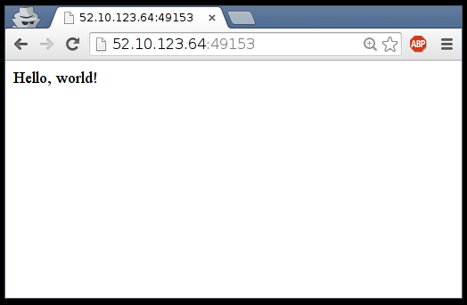

<!SLIDE>
# A simple, static web server

Run the Docker Hub image `nginx`, which contains a basic web server:

    @@@ Sh
    $ docker run -d -P nginx
    66b1ce719198711292c8f34f84a7b68c3876cf9f67015e752b94e189d35a204e

* Docker will download the image from the Docker Hub.
* `-d` tells Docker to run the image in the background.
* `-P` tells Docker to make this service reachable from other computers.
   (`-P` is the short version of `--publish-all`.)

But, how do we connect to our web server now?

<!SLIDE>
# Finding our web server port

We will use `docker ps`:

    @@@ Sh
    $ docker ps
    CONTAINER ID  IMAGE  ...  PORTS                                          ...
    e40ffb406c9e  nginx  ...  0.0.0.0:32769->80/tcp, 0.0.0.0:32768->443/tcp  ...

* The web server is running on ports 80 and 443 inside the container.
* Those ports are mapped to ports 32769 and 32768 on our Docker host.

We will explain the whys and hows of this port mapping.

But first, let's make sure that everything works properly.

<!SLIDE>
# Connecting to our web server (GUI)

Point your browser to the IP address of your Docker host, on the port
shown by `docker ps` for container port 80.

<!SLIDE>
# Connecting to our web server (CLI)

You can also use `curl` directly from the Docker host.

Make sure to use the right port number if it is different
from the example below:

    @@@ Sh
    $ curl localhost:32769
    <!DOCTYPE html>
    <html>
    <head>
    <title>Welcome to nginx!</title>
    ...

<!SLIDE>
# Why are we mapping ports?

* We are out of IPv4 addresses.
* Containers cannot have public IPv4 addresses.
* They have private addresses.
* Services have to be exposed port by port.
* Ports have to be mapped to avoid conflicts.

<!SLIDE>
# Finding the web server port in a script

Parsing the output of `docker ps` would be painful.

There is a command to help us:

    @@@ Sh
    $ docker port <containerID> 80
    32769

<!SLIDE>
# Manual allocation of port numbers

If you want to set port numbers yourself, no problem:

    @@@ Sh
    $ docker run -d -p 80:80 nginx
    $ docker run -d -p 8000:80 nginx

* We are running two NGINX web servers.
* The first one is exposed on port 80.
* The second one is exposed on port 8000.

Note: the convention is `port-on-host:port-on-container`.

<!SLIDE>
# Plumbing containers into your infrastructure

There are (at least) three ways to integrate containers in your network.

* Start the container, letting Docker allocate a public port for it.
   Then retrieve that port number and feed it to your configuration.
* Pick a fixed port number in advance, when you generate your configuration.
   Then start your container by setting the port numbers manually.
* Use an overlay network, connecting your containers with e.g. VLANs, tunnels...

<!SLIDE>
# Finding the container's IP address

We can use the `docker inspect` command to find the IP address of the
container.

    @@@ Sh
    $ docker inspect --format '{{ .NetworkSettings.IPAddress }}' <yourContainerID>
    172.17.0.3

* `docker inspect` is an advanced command, that can retrieve a ton
  of information about our containers.
* Here, we provide it with a format string to extract exactly the
  private IP address of the container.

<!SLIDE>
# Pinging our container

We can test connectivity to the container using the IP address we've
just discovered. Let's see this now by using the ``ping`` tool.

    @@@ Sh
    $ ping <ipAddress>
    64 bytes from <ipAddress>: icmp_req=1 ttl=64 time=0.085 ms
    64 bytes from <ipAddress>: icmp_req=2 ttl=64 time=0.085 ms
    64 bytes from <ipAddress>: icmp_req=3 ttl=64 time=0.085 ms

<!SLIDE>
# The old model (before Engine 1.9)

A container could use one of the following drivers:

* `bridge` (default)
* `none`
* `host`
* `container`

<!SLIDE>
# The default bridge

* By default, the container gets a virtual `eth0` interface.
   (In addition to its own private `lo` loopback interface.)
* That interface is provided by a `veth` pair.
* It is connected to the Docker bridge.
   (Named `docker0` by default; configurable with `--bridge`.)
* Addresses are allocated on a private, internal subnet.
   (Docker uses 172.17.0.0/16 by default; configurable with `--bip`.)
* Outbound traffic goes through an iptables MASQUERADE rule.
* Inbound traffic goes through an iptables DNAT rule.
* The container can have its own routes, iptables rules, etc.

<!SLIDE>
# The null driver

* Container is started with `docker run --net none ...`
* It only gets the `lo` loopback interface. No `eth0`.
* It can't send or receive network traffic.
* Useful for isolated/untrusted workloads.

<!SLIDE>
# The host driver

* Container is started with `docker run --net host ...`
* It sees (and can access) the network interfaces of the host.
* it can bind any address, any port (for ill and for good).
* Network traffic doesn't have to go through NAT, bridge, or veth.
* Performance = native!

<!SLIDE>
# The container driver

* Container is started with `docker run --net container:id ...`
* It re-uses the network stack of another container.
* It shares with this other container the same interfaces, IP address(es), routes, iptables rules, etc.
* Those containers can communicate over their `lo` interface.
   (i.e. one can bind to 127.0.0.1 and the others can connect to it.)

<!SLIDE>
# The new model (since Engine 1.9.0)

DON'T PANIC: all the previous drivers are still available.

Docker now has the notion of a *network*, and a new top-level command to manipulate and see those networks: `docker network`.

    @@@ Sh
    $ docker network ls
    NETWORK ID          NAME                DRIVER
    6bde79dfcf70        bridge              bridge
    8d9c78725538        none                null
    eb0eeab782f4        host                host
    4c1ff84d6d3f        skynet              bridge
    228a4355d548        darknet             overlay
    3f1733d3e233        darkernet           overlay

<!SLIDE>
# What's in a network?

* Conceptually, a network is a virtual switch.
* It can be local (to a single Engine) or global (across multiple hosts).
* A network has an IP subnet associated to it.
* A network is managed by a *driver*.
* A network can have a custom IPAM (IP allocator).
* Containers with explicit names are discoverable via DNS.
* All the drivers that we have seen before are available.
* A new multi-host driver, *overlay*, is available.
* More drivers can be provided by plugins (OVS, VLAN...)

<!SLIDE>
# Creating a network

Let's create a network.

    @@@ Sh
    $ docker network create skynet
    4c1ff84d6d3f1733d3e233ee039cac276f425a9d5228a4355d54878293a889ba

The network is now visible with the `network ls` command:

    @@@ Sh
    $ docker network ls
    NETWORK ID          NAME                DRIVER
    6bde79dfcf70        bridge              bridge
    8d9c78725538        none                null
    eb0eeab782f4        host                host
    4c1ff84d6d3f        skynet              bridge

<!SLIDE>
# Placing containers on a network

We will create two *named* containers on this network.

First, let's create this container in the background.

    @@@ Sh
    $ docker run -dti --name t800 --net skynet alpine sh
    8abb80e229ce8926c7223beb69699f5f34d6f1d438bfc5682db893e798046863

Now, create this other container in the foreground.

    @@@ Sh
    $ docker run -ti --name t1000 --net skynet ubuntu
    root@0ecccdfa45ef:/#

<!SLIDE>
# Communication between containers

From our new container (t1000), we can resolve and ping the other one, using its assigned name:

    @@@ Sh
    root@0ecccdfa45ef:/# ping t800
    PING t800 (172.18.0.2) 56(84) bytes of data.
    64 bytes from t800 (172.18.0.2): icmp_seq=1 ttl=64 time=0.221 ms
    64 bytes from t800 (172.18.0.2): icmp_seq=2 ttl=64 time=0.114 ms
    64 bytes from t800 (172.18.0.2): icmp_seq=3 ttl=64 time=0.114 ms
    ^C
    --- t800 ping statistics ---
    3 packets transmitted, 3 received, 0% packet loss, time 2000ms
    rtt min/avg/max/mdev = 0.114/0.149/0.221/0.052 ms
    root@0ecccdfa45ef:/#

How did that work?

<!SLIDE>
# Resolving container addresses

Currently, name resolution is implemented with /etc/hosts, and
updating it each time containers are added/removed.

    @@@ Sh
    root@0ecccdfa45ef:/# cat /etc/hosts
    172.18.0.3  0ecccdfa45ef
    127.0.0.1       localhost
    ::1     localhost ip6-localhost ip6-loopback
    fe00::0 ip6-localnet
    ff00::0 ip6-mcastprefix
    ff02::1 ip6-allnodes
    ff02::2 ip6-allrouters
    172.18.0.2      t800
    172.18.0.2      t800.skynet

In the future, this will *probably* be replaced by a dynamic resolver.

<!SLIDE>
# Connecting to multiple networks

Let's create another network.

    @@@ Sh
    $ docker network create resistance
    955b84336816b8e2265a156905aa716f5d1d880516ceaba48b9331f8f4e706aa

Create a container in this network.

    @@@ Sh
    $ docker run --net resistance -ti --name sarahconnor ubuntu
    root@4937d654a579:/# 

This container cannot ping t800 (try it).

Now, from another terminal, connect t800 to the resistance:

    @@@ Sh
    $ docker network connect resistance t800

Then try again to ping t800 from sarahconnor. It works!

<!SLIDE>
# Implementation details

With the "bridge" network driver, each container joining a network receives a new virtual interface.

Each container receives a new virtual interface:

    @@@ Sh
    $ docker run --net container:t800 alpine ip a
    1: lo: <LOOPBACK,UP,LOWER_UP> mtu 65536 qdisc noqueue state UNKNOWN 
        link/loopback 00:00:00:00:00:00 brd 00:00:00:00:00:00
        inet 127.0.0.1/8 scope host lo
           valid_lft forever preferred_lft forever
        inet6 ::1/128 scope host 
           valid_lft forever preferred_lft forever
    73: eth0@if74: <BROADCAST,MULTICAST,...> mtu 1500 qdisc noqueue state UP 
        link/ether 02:42:ac:12:00:02 brd ff:ff:ff:ff:ff:ff
        inet 172.18.0.2/16 scope global eth0
           valid_lft forever preferred_lft forever
        inet6 fe80::42:acff:fe12:2/64 scope link 
           valid_lft forever preferred_lft forever
    84: eth1@if85: <BROADCAST,MULTICAST,...> mtu 1500 qdisc noqueue state UP 
        link/ether 02:42:ac:13:00:03 brd ff:ff:ff:ff:ff:ff
        inet 172.19.0.3/16 scope global eth1
           valid_lft forever preferred_lft forever
        inet6 fe80::42:acff:fe13:3/64 scope link 
           valid_lft forever preferred_lft forever

<!SLIDE>
# Multi-host networking

Out of the scope for this intro-level workshop!

Very short instructions:

- deploy a key/value store (Consul, Etc, Zookeeper)
- add two extra flags to your Docker Engine
- you can now create networks using the overlay driver!

When you create a network on one host with the overlay driver, it
appears automatically on all other hosts.

Containers placed on the same networks are able to resolve and
ping as if they were local.

The overlay network is based on VXLAN and store neighbor info
in a key/value store.

<!SLIDE>
# Section summary

We've learned how to:

* Expose a network port.
* Manipulate container networking basics.
* Find a container's IP address.
* Create private networks for groups of containers.

**NOTE: Later we will see another mechanism to interconnect
containers using the `link` primitive.**

<!SLIDE supplemental exercises>
# Lab ~~~SECTION:MAJOR~~~.~~~SECTION:MINOR~~~: Create a container

1. Create a new container.

         @@@ Sh
         $ docker run -d -p 80 training/webapp python -m SimpleHTTPServer 80

2. Make a note of the container ID.

3. Check the container is running.

         @@@ Sh
         $ docker ps

<!SLIDE supplemental exercises>
# Lab ~~~SECTION:MAJOR~~~.~~~SECTION:MINOR~~~: Checking the container's port mapping

1. Retrieve the container's port mapping.

         @@@ Sh
         $ docker port <yourContainerId> 80

2. Note also that you can get this information using ``docker inspect -f``:

         @@@ Sh
         $ docker inspect -f "{{ json .NetworkSettings.Ports }}" <yourContainerID>
         {"5000/tcp":null,"80/tcp":[{"HostIp":"0.0.0.0","HostPort":"49153"}]}

2. Make a note of the port number returned.

<!SLIDE supplemental exercises>
# Lab ~~~SECTION:MAJOR~~~.~~~SECTION:MINOR~~~: Browse to the web server

1. Browse to the URL.

        @@@ Sh
        http://<yourHostIP>:<portNumber>

2. You should see a directory listing for your container.

<!SLIDE supplemental exercises>
# Lab ~~~SECTION:MAJOR~~~.~~~SECTION:MINOR~~~: Finding the container's IP address

1. Now retrieve the container's IP address.

        @@@ Sh
        $ docker inspect --format \
          '{{ .NetworkSettings.IPAddress }}' \
          <yourContainerId>

2. Make a note of the IP address returned.

3. Ping the IP address.

        @@@ Sh
        $ ping <ipAddress>

4. You should see a response.

        @@@ Sh
        64 bytes from <ipAddress>: icmp_req=2 ttl=64 time=0.085 ms
        64 bytes from <ipAddress>: icmp_req=2 ttl=64 time=0.085 ms
