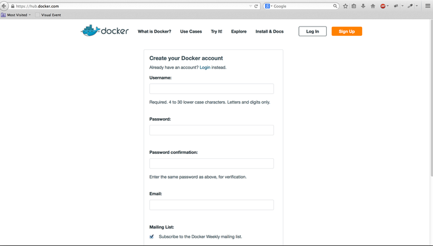
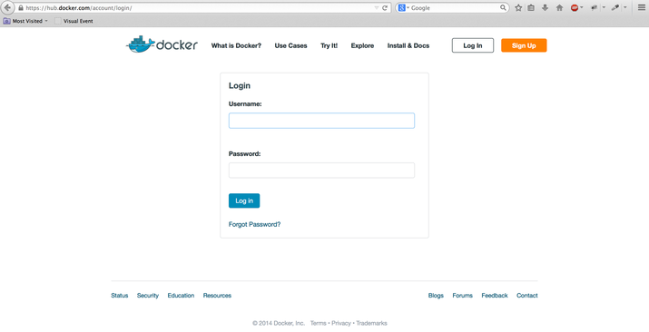
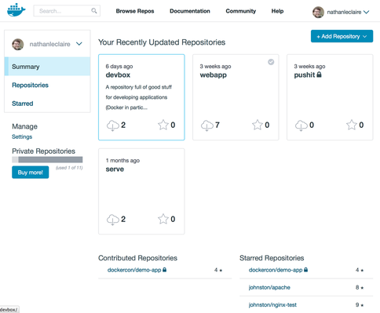
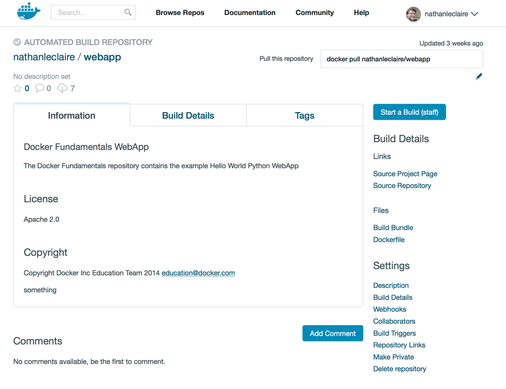
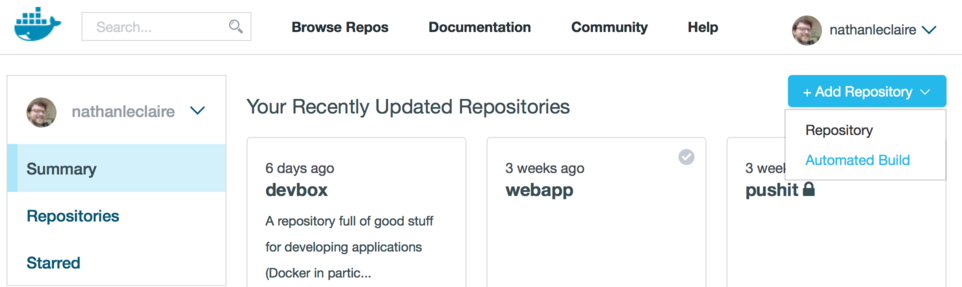
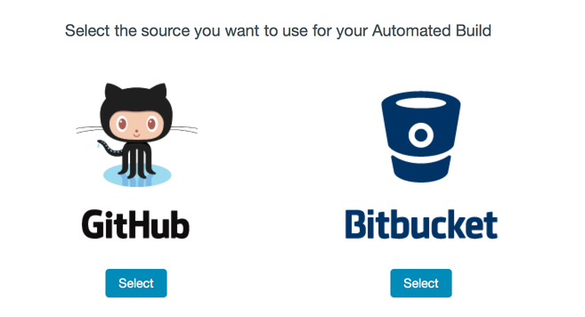
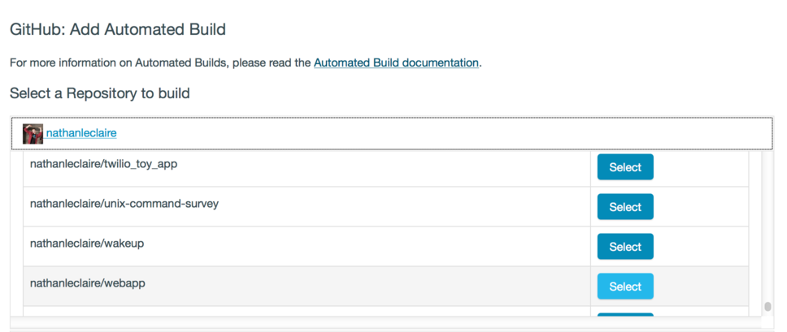

<!SLIDE>
# Using the Docker Hub

We have built our own container image.

This image would be useful to the whole team but how do we share it?

Using the [Docker Hub](http://hub.docker.com/)!

<!SLIDE>
# Pulling images

Earlier in this training we saw how to pull images down from the Docker Hub.

    @@@ Sh
    $ docker pull ubuntu:14.04

This will connect to the Docker Hub and download the ``ubuntu:14.04``
image to allow us to build containers from it.

We can also do the reverse and push an image to the Docker Hub so that others
can use it.

<!SLIDE>
# Before pushing a Docker image ...

We push images using the ``docker push`` command.

Images are uploaded via HTTP and authenticated.

You can only push images to the *user namespace*, and with your
own username.

This means that you cannot push an image called ``web``.

It has to be called ``<dockerhubUsername>/web``.

<!SLIDE>
# Name your image properly

Here are different ways to ensure that your image has the right name.

Of course, in the examples below, replace ``<dockerhubUsername>``
with your actual login on the Docker Hub.

* If you have previously built the ``ifconfigme`` image, you can re-tag it:

        @@@ Sh
        $ docker tag ifconfigme <dockerhubUsername>/ifconfigme

* Or, you can also rebuild it from scratch:

        @@@ Sh
        $ docker build -t <dockerhubUsername>/ifconfigme \
          git://github.com/jpetazzo/ifconfigme.git

<!SLIDE>
# Pushing a Docker image to the Docker Hub

Now that the image is named properly, we can push it:

    @@@ Sh
    $ docker push <dockerhubUsername>/ifconfigme

You will be prompted for a user name and password.

(Unless you already did ``docker login`` earlier.)

    @@@ Sh
    Please login prior to push:
    Username: <dockerhubUsername>
    Password: *********
    Email: ...
    Login Succeeded

You will login using your Docker Hub name, account and email address you
created earlier in the training.

<!SLIDE>
# More about pushing an image

* If the image doesn't exist on the Docker Hub, a new repository will be
  created.
* You can push an updated image on top of an existing image. Only the
  layers which have changed will be updated.
* When you pull down the resulting image, only the updates will need to
  be downloaded.

<!SLIDE>
# Viewing our uploaded image

Let's sign onto the [Docker Hub](https://hub.docker.com/) and review
our uploaded image.

Browse to:

    @@@ Sh
    https://hub.docker.com/

<!SLIDE>
# Logging in to the Docker Hub

Now click the ``Login`` link and fill in the ``Username`` and
``Password`` fields.

And clicking the ``Log In`` button.

<!SLIDE>
# Your account screen

This is the master account screen.  Here you can see your repositories and recent activity.

<!SLIDE>
# Review your webapp repository

Click on the link to your ``<dockerhubUsername>/web`` repository.

* You can see the basic information about your image.
* You can also browse to the ``Tags`` tab to see image tags, or navigate to a link in the "Settings" sidebar to configure the repo.

<!SLIDE>
# Automated Builds

In addition to pushing images to Docker Hub you can also create special
images called *Automated Builds*. An *Automated Build* is created from a
``Dockerfile`` in a GitHub repository.

This provides a guarantee that the image came from a specific source and
allows you to ensure that any downloaded image is built from a
``Dockerfile`` you can review.

<!SLIDE>
# Creating an Automated build

To create an *Automated Build* click on the ``Add Repository`` button on your main
account screen and select ``Automated Build``.

<!SLIDE>
# Connecting your GitHub account

If this is your first *Automated Build* you will be prompted to connect
your GitHub account to the Docker Hub.

<!SLIDE>
# Select specific GitHub repository

You can then select a specific GitHub repository.

It must contain a ``Dockerfile``.

If you don't have a repository with a Dockerfile, you can
fork https://github.com/docker-training/staticweb, for instance.

<!SLIDE>
# Configuring Automated Build

You can then configure the specifics of your *Automated Build* and click
the ``Create Repository`` button.

<!SLIDE>
# Automated Building

Once configured your *Automated Build* will automatically start building
an image from the ``Dockerfile`` contained in your Git repository.

Every time you make a commit to that repository a new version of the
image will be built.

<!SLIDE>
# Section summary

We've learned how to:

* Pull and push images to the Docker Hub.
* Explore the Docker Hub.
* Understand and create *Automated Builds*.

<!SLIDE supplemental exercises>
# Lab ~~~SECTION:MAJOR~~~.~~~SECTION:MINOR~~~: Push your web image

1. Run the ``docker push`` command.

        @@@ Sh
        $ docker push <dockerhubUsername>/web

2. Login into your Docker Hub account using your user name, password
   and email.

3. Confirm your image was successfully pushed.

<!SLIDE supplemental exercises>
# Lab ~~~SECTION:MAJOR~~~.~~~SECTION:MINOR~~~: Review your pushed image

1. Browse to the Docker Hub.

        @@@ Sh
        https://hub.docker.com/

2. Click on the Login link.

        @@@ Sh
        https://hub.docker.com/account/login/

3. Login using your user name and password.

<!SLIDE supplemental exercises>
# Lab ~~~SECTION:MAJOR~~~.~~~SECTION:MINOR~~~: View your image repository

1. Browse to your new image repository, either by clicking on the link or by
   visiting the following URL:

        @@@ Sh
        https://registry.hub.docker.com/u/<dockerhubUsername>/staticweb/

2. Explore the tabs and settings available to you.

<!SLIDE supplemental exercises>
# Lab ~~~SECTION:MAJOR~~~.~~~SECTION:MINOR~~~: Create an automated build

To create an *Automated Build* click on the ``Add Repository`` button on your main
account screen and select ``Automated Build``.

<!SLIDE supplemental exercises>
# Connecting to your Github account

If this is your first *Automated Build* you will be prompted to connect
your GitHub account to the Docker Hub.

<!SLIDE>

<!SLIDE supplemental exercises>
# Connecting to your Github account

You can then select a specific GitHub repository.

It must contain a ``Dockerfile``.

If you don't have a repository with a Dockerfile, you can
fork `https://github.com/docker-training/staticweb`, for instance.

<!SLIDE supplemental exercises>
# Configuring an automated build

You can then configure the specifics of your *Automated Build* and click
the ``Create Repository`` button.

