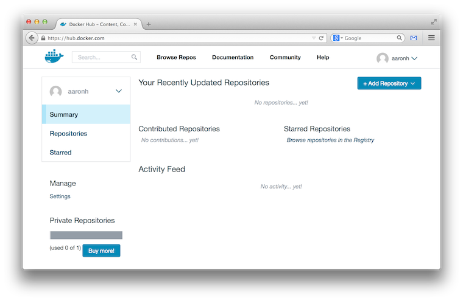
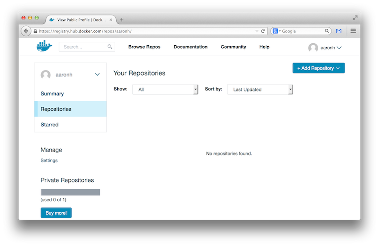
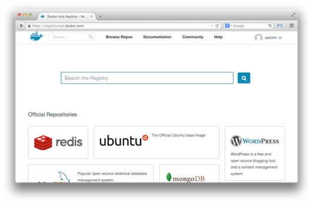
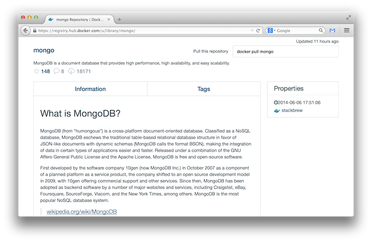
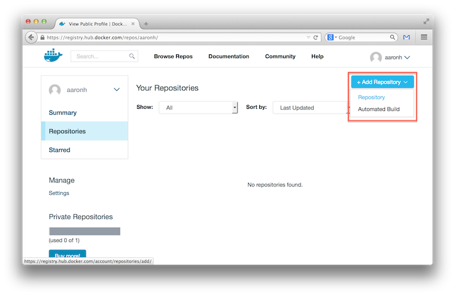
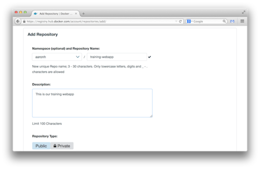
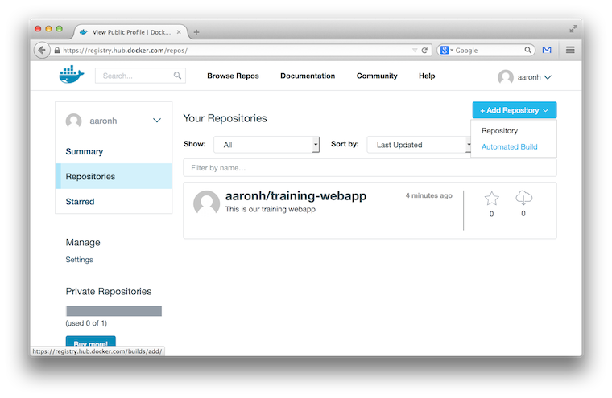
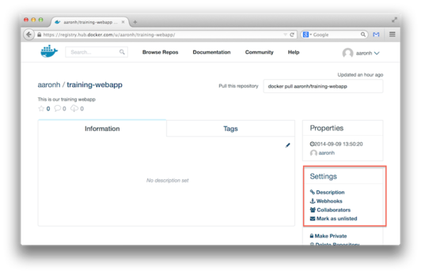
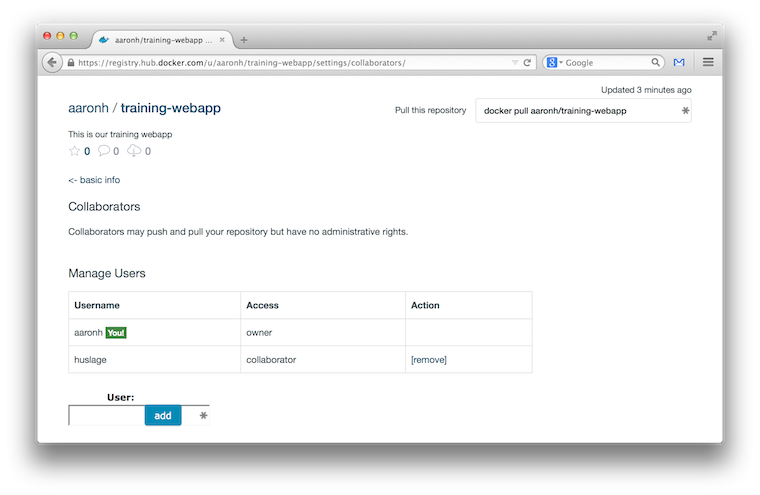
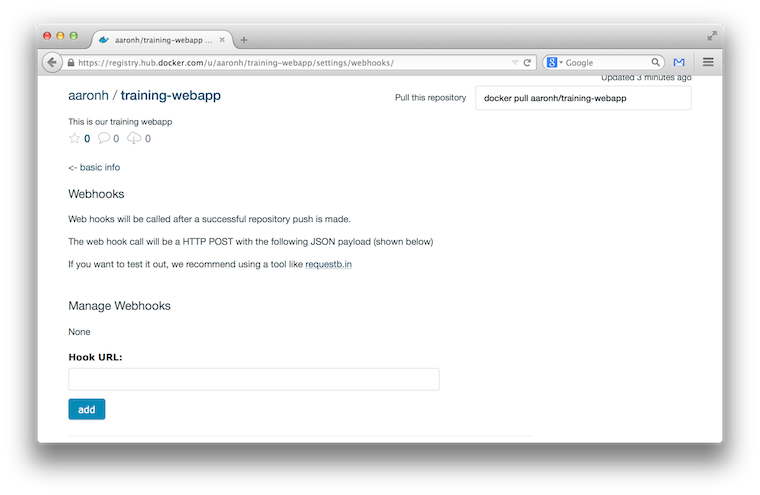

<!SLIDE>
# Sign up for a Docker Hub account

Note: if you already have an account on the Index/Hub, don't create another one.

- Having a Docker Hub account will allow us to store our images in the registry.
- To sign up, you'll go to [hub.docker.com](http://hub.docker.com) and fill out the form.
- Note: your Docker Hub username has to be all lowercase.

<!SLIDE>
# Activate your account through e-mail.

- Check your e-mail and click the confirmation link.

<!SLIDE>
# Login
Let's use our new account to login to the Docker Hub!

    @@@ Sh
    $ docker login
    Username: my_docker_hub_login
    Password:
    Email: my@email.com
    Login Succeeded

Our credentials will be stored in ``~/.dockercfg``.

<!SLIDE>
# The ``.dockercfg`` configuration file

The ``~/.dockercfg`` configuration file holds our Docker registry
authentication credentials.

    @@@ Sh
    {
      "https://index.docker.io/v1/": {
        "auth":"amFtdHVyMDE6aTliMUw5ckE=",
        "email":"education@docker.com"
      }
    }

The ``auth`` section is Base64 encoding of your user name and password.

It should be owned by your user with permissions of ``0600``.

**You should protect this file!**

<!SLIDE>
# Navigating Docker Hub

<!SLIDE>
# Repositories

- Store all public and private images in the registry
- Apply to your namespace
- Empty!

<!SLIDE>
# Public Repositories

- Docker Hub provides access to tens of thousands of pre-made images that you can build from.
- Some of these are `official builds` and live in the root namespace.
- Most are community contributed and maintained.

<!SLIDE>
# Official Repositories

- Are maintained by the product owners
- Blessed by Docker

<!SLIDE>
# New Repository (1/3)

- Pull down `Add Repository` menu and select `Repository`

<!SLIDE>
# New Repository (2/3)

- Leave `namespace` at the default (your username)
- Give your repository a name
- Type a brief description so people know what it is
- Leave `Public` selected
- Submit the form with `Add Repository` button (not shown)

<!SLIDE>
# New Repository (3/3)

- Click `Repositories` and you will see your new repository.
- You can push images to this repository from the `docker` commandline.
- More on this later.

<!SLIDE>
# Repository Settings

You can change the following:

- Repository Description
- Webhooks
- Collaborators
- Mark as unlisted in the global search (NOT a private repository)

<!SLIDE>
# Collaborators

You can invite other Docker Hub to collaborate on your projects.

- Collaborators cannot change settings in the repository.
- Collaborators can push images to the repository.

<!SLIDE>
# Webhooks

- Notify external applications that an image has been uploaded to the repository.
- Powerful tool for integrating with your development workflow.
- Even more powerful when used with Automated Builds.

<!SLIDE>
# Automated Builds

- Automatically build an image when source code is changed.
- Integrated with Github and Bitbucket
- Work with public and private repositories
- Add the same as a regular repository, select `Automated Build` from the `Add Repository` menu
- We'll set one of these up later!
    - You will need a Github account to follow along later, so go ahead and create one now if you don't
      have one yet.

<!SLIDE>
# Section summary

We've learned how to:

* Register for an account on Docker Hub.
* Login to your account from the command line.
* Access some special Docker Hub features for better workflows.

<!SLIDE supplemental exercises>
# Lab ~~~SECTION:MAJOR~~~.~~~SECTION:MINOR~~~: Register an account with Docker Hub

1.  Go to [hub.docker.com](https://hub.docker.com) and fill out the form to register an account.
2.  Click the activation link in the e-mail you have been sent to confirm.

<!SLIDE supplemental exercises>
# Lab ~~~SECTION:MAJOR~~~.~~~SECTION:MINOR~~~: Logging in to Docker Hub

1. Login to the Docker Hub on the command line now. You'll need the
   user name and password you created in Lab 1.1.

        @@@ Sh
        $ docker login

2. You should see and type:

        @@@ Sh
        Username: myDockerHubusername
        Password:
        Email: my@email.com
        Login Succeeded

3. Check the contents of the ``~/.dockercfg`` file.

        @@@ Sh
        $ cat ~/.dockercfg
        {
          "https://index.docker.io/v1/": {
            "auth":"amFtdHVyMDE6aTliMUw5ckE=",
            "email":"education@docker.com"
          }
        }

<!SLIDE supplemental exercises>
# Lab ~~~SECTION:MAJOR~~~.~~~SECTION:MINOR~~~: Set up a Github account

If you don't have a Github account, go ahead and set one up now.  We will need to use this later
for creating Automated Builds, a feature of Docker Hub that allows you to automatically re-build
an image when the source code contained within that image changes.

