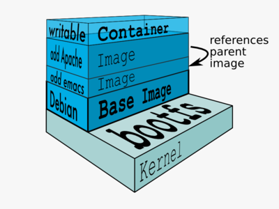

<!SLIDE>
# Images

What are they?

* An image is a collection of files.
* *Base images* (ubuntu, busybox, fedora etc.) are what you build your own custom images on top of.
* Images are *layered*, and each layer represents a diff (what changed) from the previous layer.  For instance, 
  you could add Python 3 on top of a base image.

<!SLIDE>
# So what's the difference between Containers and Images?

- Containers represent an encapsulated set of processes based on an image.
- You spawn them with the ``docker run`` command.
- In our "Instant Gratification" example, you created a shiny new container by executing ``docker run``. 
  It was based on the `busybox` image, and we ran the `echo` command.
- Images are like templates or stencils that you can create containers from.

<!SLIDE>
# How do you create images?

Images can be created by:

* Manually starting a container, entering it, making changes to it and committing those changes.
* Dockerfiles (more on this later)

<!SLIDE>
# How do you store and manage images?

Images can be stored:

* On your Docker host.
* In a Docker registry.

You can use the Docker client to manage images.

<!SLIDE>
# Searching for images

Searches your registry for images:

    @@@ Sh
    $ docker search training
    NAME                                    DESCRIPTION   STARS     OFFICIAL   AUTOMATED
    training/jenkins                                      0                    [OK]
    training/webapp                                       0                    [OK]
    training/ls                                           0                    [OK]
    training/namer                                        0                    [OK]
    training/postgres                                     0                    [OK]
    training/notes                                        0                    [OK]
    training/docker-fundamentals-image                    0                    [OK]
    training/showoff                                      0                    

<!SLIDE>
# Images belong to a namespace

There are three namespaces:

* Root-like

        @@@ Sh
        ubuntu

* User

        @@@ Sh
        training/docker-fundamentals-image

* Self-Hosted

        @@@ Sh
        registry.example.com:5000/my-private-image

<!SLIDE>
# Root namespace

The root namespace is for official images. They are put there by Docker Inc.,
but they are generally authored and maintained by third parties.

Those images include some barebones distro images, for instance:

* ubuntu
* fedora
* centos

Those are ready to be used as bases for your own images.

<!SLIDE>
# User namespace

The user namespace holds images for Docker Hub users and organizations.

For example:

    @@@ Sh
    training/docker-fundamentals-image

The Docker Hub user is:

    @@@ Sh
    training

The image name is:

    @@@ Sh
    docker-fundamentals-image

<!SLIDE>
# Self-Hosted namespace

This namespace holds images which are not hosted on Docker Hub, but on third
party registries.

They contain the hostname (or IP address), and optionally the port, of the
registry server.

For example:

    @@@ Sh
    localhost:5000/wordpress

The remote host and port is:

    @@@ Sh
    localhost:5000

The image name is:

    @@@ Sh
    wordpress

Note: self-hosted registries used to be called *private* registries,
but this is misleading!

* A self-hosted registry can be public or private.
* A registry in the User namespace on Docker Hub can be public or private.

<!SLIDE>
# Downloading images

We already downloaded two root images earlier:

* The busybox image, implicitly, when we did ``docker run busybox``.
* The ubuntu image, explicitly, when we did ``docker pull ubuntu``.

Download a user image.

    @@@ Sh
    $ docker pull training/docker-fundamentals-image
    Pulling repository training/docker-fundamentals-image
    8144a5b2bc0c: Download complete
    511136ea3c5a: Download complete
    8abc22fbb042: Download complete
    58394af37342: Download complete
    6ea7713376aa: Download complete
    71ef82f6ed3c: Download complete

<!SLIDE>
# Showing current images

Let's look at what images are on our host now.

    @@@ Sh
    $ docker images
    REPOSITORY                         TAG     IMAGE ID     CREATED     VIRTUAL SIZE
    training/docker-fundamentals-image latest  8144a5b2bc0c 5 days ago  835 MB
    ubuntu                             13.10   9f676bd305a4 7 weeks ago 178 MB
    ubuntu                             saucy   9f676bd305a4 7 weeks ago 178 MB
    ubuntu                             raring  eb601b8965b8 7 weeks ago 166.5 MB
    ubuntu                             13.04   eb601b8965b8 7 weeks ago 166.5 MB
    ubuntu                             12.10   5ac751e8d623 7 weeks ago 161 MB
    ubuntu                             quantal 5ac751e8d623 7 weeks ago 161 MB
    ubuntu                             10.04   9cc9ea5ea540 7 weeks ago 180.8 MB
    ubuntu                             lucid   9cc9ea5ea540 7 weeks ago 180.8 MB
    ubuntu                             12.04   9cd978db300e 7 weeks ago 204.4 MB
    ubuntu                             latest  9cd978db300e 7 weeks ago 204.4 MB
    ubuntu                             precise 9cd978db300e 7 weeks ago 204.4 MB

<!SLIDE>
# Image and tags

* Images can have tags.
* Tags define image variants.
* When using images it is always best to be specific.

<!SLIDE>
# Downloading an image tag

    @@@ Sh
    $ docker pull debian:jessie
    Pulling repository debian
    b164861940b8: Download complete 
    b164861940b8: Pulling image (jessie) from debian 
    d1881793a057: Download complete 

* As seen previously, images are made up of layers.
* Docker has downloaded all the necessary layers.

<!SLIDE>
# Section summary

We've learned how to:

* Understand images and image tags.
* Search for images.
* Download an image.
* Understand Docker image namespacing.

<!SLIDE supplemental exercises>
# Lab ~~~SECTION:MAJOR~~~.~~~SECTION:MINOR~~~: Find an image

1. Run the ``docker search`` command.

        @@@ Sh
        $ docker search training

2. You should see something like:

        @@@ Sh
        NAME                                    DESCRIPTION   STARS     OFFICIAL   AUTOMATED
        training/jenkins                                      0                    [OK]
        training/webapp                                       0                    [OK]
        training/ls                                           0                    [OK]
        training/namer                                        0                    [OK]
        training/postgres                                     0                    [OK]
        training/notes                                        0                    [OK]
        training/docker-fundamentals-image                    0                    [OK]
        training/showoff                                      0                    
        . . .

<!SLIDE supplemental exercises>
# Lab ~~~SECTION:MAJOR~~~.~~~SECTION:MINOR~~~: Retrieve a user image

1. Pull down the ``training/docker-fundamentals-image`` image using the 
   ``docker pull`` command.

        @@@ Sh
        $ docker pull training/docker-fundamentals-image
        Pulling repository training/docker-fundamentals-image
        8144a5b2bc0c: Pulling dependent layers
        511136ea3c5a: Download complete
        8abc22fbb042: Download complete

<!SLIDE supplemental exercises>
# Lab ~~~SECTION:MAJOR~~~.~~~SECTION:MINOR~~~: Show currently installed images

1. View the currently installed images using the ``docker images``
   command.

        @@@ Sh
        $ docker images
        REPOSITORY                         TAG     IMAGE ID     CREATED     VIRTUAL SIZE
        training/docker-fundamentals-image latest  8144a5b2bc0c 5 days ago  835 MB
        ubuntu                             13.10   9f676bd305a4 7 weeks ago 178 MB
        ubuntu                             saucy   9f676bd305a4 7 weeks ago 178 MB
        ubuntu                             raring  eb601b8965b8 7 weeks ago 166.5 MB
        ubuntu                             13.04   eb601b8965b8 7 weeks ago 166.5 MB
        ubuntu                             12.10   5ac751e8d623 7 weeks ago 161 MB
        ubuntu                             quantal 5ac751e8d623 7 weeks ago 161 MB
        ubuntu                             10.04   9cc9ea5ea540 7 weeks ago 180.8 MB
        ubuntu                             lucid   9cc9ea5ea540 7 weeks ago 180.8 MB
        ubuntu                             12.04   9cd978db300e 7 weeks ago 204.4 MB
        ubuntu                             latest  9cd978db300e 7 weeks ago 204.4 MB
        ubuntu                             precise 9cd978db300e 7 weeks ago 204.4 MB

<!SLIDE supplemental exercises>
# Lab ~~~SECTION:MAJOR~~~.~~~SECTION:MINOR~~~: Retrieve a tagged image

1. Pull down a tagged image using the ``docker pull`` command.

        @@@ Sh
        $ docker pull debian:jessie
        Pulling repository debian
        58394af37342: Download complete
        511136ea3c5a: Download complete
        8abc22fbb042: Download complete
